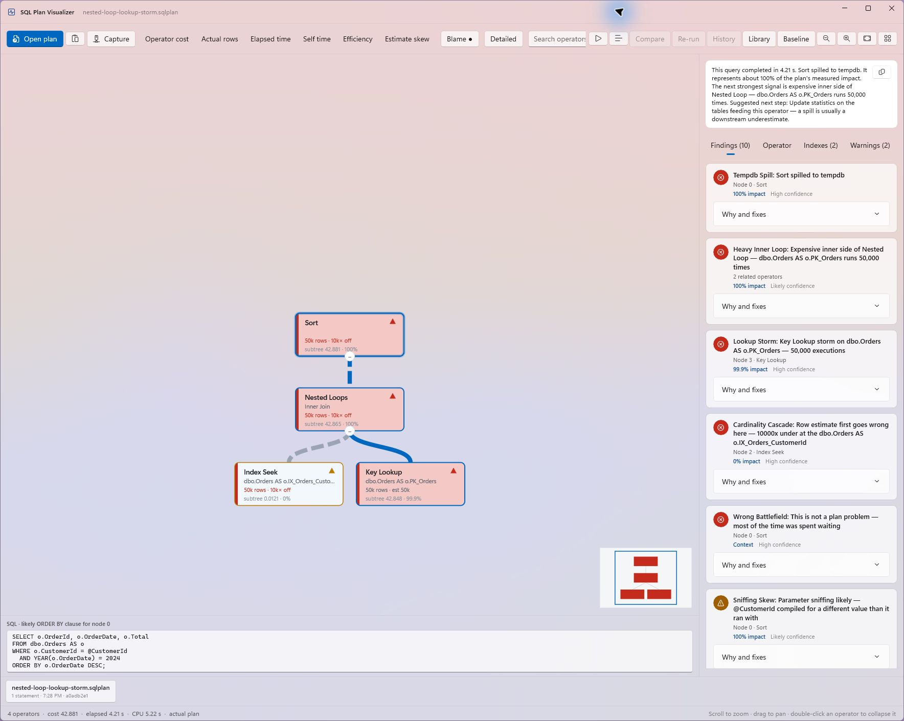
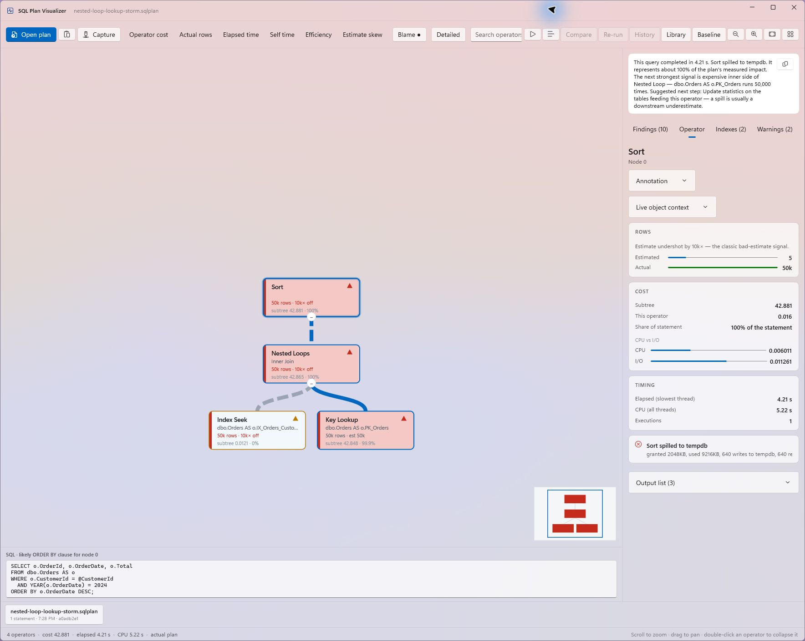
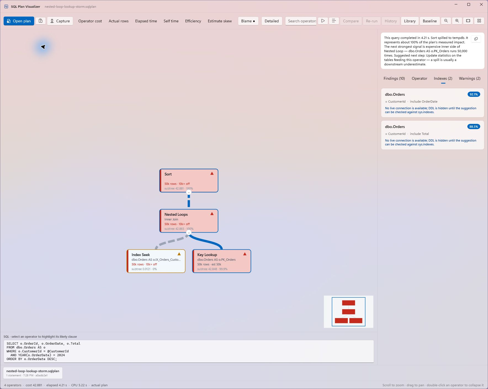

# SQL Plan Visualizer

SQL Plan Visualizer is a native Windows application for understanding SQL Server execution plans. It turns Showplan XML into an interactive tree, ranks the most important performance findings, and explains what the plan is doing in practical terms.



## Understand the plan, not just the diagram

Execution plans contain a lot of useful evidence, but finding the part that deserves attention can be slow. SQL Plan Visualizer brings the plan shape, runtime measurements, warnings, and tuning guidance into one workspace.

- Explore an interactive, cost-weighted operator tree.
- Rank operators by subtree cost, operator cost, actual rows, elapsed time, self time, efficiency, or estimate skew.
- Surface spills, lookup storms, cardinality errors, stale statistics, implicit conversions, parameter sniffing, and other common plan problems.
- See findings ranked by impact and confidence, with explanations and suggested next steps.
- Inspect estimated versus actual rows, cost, timing, predicates, output columns, and operator warnings.
- Review missing-index suggestions and avoid presenting unchecked DDL when no live database connection is available.
- Map a selected operator back to the SQL clause it most likely represents.
- Search, zoom, pan, collapse subtrees, focus the hot path, and replay operators in execution order.
- Compare captured plans and save regression baselines for later checks.

## Operator details

Select a finding or operator to see the evidence behind it. The detail pane combines row-estimate accuracy, cost, CPU and I/O, runtime timing, executions, warnings, predicates, and output columns.



## Index suggestions

Missing-index recommendations are collected in one place with impact scores and key/include columns. When connected to SQL Server, suggestions can be checked against existing indexes before generating DDL.



## Open or capture a plan

The app accepts SQL Server `.sqlplan` files and Showplan XML in several ways:

- Open a file.
- Drag a plan onto the window.
- Paste Showplan XML from the clipboard.
- Pass a plan path on the command line.
- Connect to SQL Server and capture an actual or estimated plan.

Actual-plan capture uses `SET STATISTICS XML ON`. Estimated-plan capture uses `SET SHOWPLAN_XML ON`, so the query is compiled without being executed. Connection credentials are held only for the active connection and are not written to disk.

## Run locally

Requirements:

- Windows 10 version 1809 or later
- .NET 8 SDK

Start the app:

```powershell
dotnet run --project src/SqlPlanViz
```

Open the bundled sample directly:

```powershell
dotnet run --project src/SqlPlanViz -- samples/nested-loop-lookup-storm.sqlplan
```

## Build a standalone copy

Publish a self-contained Windows build:

```powershell
dotnet publish src/SqlPlanViz -c Release -o dist
```

Run `dist/SqlPlanViz.exe` on the target machine. The publish folder includes the Windows App SDK runtime, so an installer is not required.

## Technology

SQL Plan Visualizer is built with WinUI 3, .NET 8, Win2D, CommunityToolkit.Mvvm, and Microsoft.Data.SqlClient.

For implementation and design details, see the [technical design document](docs/tdd.md).
